<div align="center">

<!-- Animated Header -->


<!-- Typing SVG with Multiple Lines -->

<div align="center">
  
</div>

<!-- Animated Snake -->

<picture>
  <source media="(prefers-color-scheme: dark)" srcset="https://raw.githubusercontent.com/platane/snk/output/github-contribution-grid-snake-dark.svg">
  <source media="(prefers-color-scheme: light)" srcset="https://raw.githubusercontent.com/platane/snk/output/github-contribution-grid-snake.svg">
  
</picture>

<!-- Social Badges with Animation -->

<p align="center">
  <a href="https://github.com/codebyamine">
    
  </a>
  <a href="https://linkedin.com/in/amine-ghanjfa">
    
  </a>
  <a href="mailto:contact@amineghanjfa.dev">
    
  </a>
  <a href="https://instagram.com/codebyamine">
    
  </a>
  <a href="https://twitter.com/codebyamine">
    
  </a>
  <a href="https://portfolio.amineghanjfa.dev">
    
  </a>
</p>

<!-- Visitor Counter with Cool Design -->

<p align="center">
  
  
  
</p>

</div>

<!-- Animated Divider -->


<!-- About Section with Glassmorphism Style -->

<div align="center">

## 🎯 『 ABOUT ME 』

</div>

```javascript
class AmineGhanjfa {
    constructor() {
        this.name = "Amine Ghanjfa";
        this.role = "Full-Stack Developer & AI Automation Architect";
        this.company = "Available for Hire 💼";
        this.location = "🌍 Remote | Worldwide";
        this.languages = {
            spoken: ["Arabic", "French", "English"],
            programming: ["JavaScript", "Python", "C++", "TypeScript", "PHP"]
        };
    }

    get expertise() {
        return {
            frontend: {
                core: ["HTML5", "CSS3", "JavaScript ES6+"],
                frameworks: ["React.js", "Vue.js", "Next.js", "Nuxt.js"],
                styling: ["Tailwind CSS", "SCSS", "Bootstrap", "Material-UI"],
                tools: ["Webpack", "Vite", "Babel"]
            },
            backend: {
                runtime: ["Node.js", "Deno"],
                frameworks: ["Express", "Nest.js", "Django", "FastAPI"],
                languages: ["Python", "C++", "PHP", "Java"]
            },
            aiAutomation: {
                platforms: ["N8N Workflow Automation", "Zapier", "Make"],
                aiTools: ["OpenAI GPT", "AI Agents", "LangChain", "Hugging Face"],
                skills: ["Process Automation", "Chatbot Development", "ML Integration"]
            },
            database: {
                sql: ["PostgreSQL", "MySQL", "SQLite"],
                noSql: ["MongoDB", "Redis", "Firebase"],
                orm: ["Prisma", "TypeORM", "Mongoose"]
            },
            devOps: {
                containerization: ["Docker", "Kubernetes"],
                ciCd: ["GitHub Actions", "GitLab CI", "Jenkins"],
                cloud: ["AWS", "Google Cloud", "Vercel", "Netlify"],
                monitoring: ["Grafana", "Prometheus"]
            }
        };
    }

    get currentlyWorking() {
        return [
            "🤖 Building intelligent AI automation systems",
            "🚀 Developing high-performance web applications",
            "📚 Learning advanced ML & AI architectures",
            "💼 Open to exciting opportunities"
        ];
    }

    get achievements() {
        return {
            projects: "50+ Completed Projects",
            clients: "Happy Clients Worldwide",
            codeQuality: "Clean & Scalable Architecture",
            availability: "Ready to Start Immediately"
        };
    }

    async collaborate() {
        return "Let's build something extraordinary together! 🚀";
    }
}

const amine = new AmineGhanjfa();
console.log(amine.collaborate());
```

<!-- Animated Divider -->


<!-- Value Proposition -->

<div align="center">

## 💎 『 WHY CHOOSE ME 』

<table>
<tr>
<td align="center" width="25%">
<br>
<b>🚀 Fast Delivery</b><br>
<sub>On-time, Every Time</sub>
</td>
<td align="center" width="25%">
<br>
<b>💡 Innovation</b><br>
<sub>Cutting-Edge Solutions</sub>
</td>
<td align="center" width="25%">
<br>
<b>🎯 Quality Code</b><br>
<sub>Clean & Maintainable</sub>
</td>
<td align="center" width="25%">
<br>
<b>🤝 Communication</b><br>
<sub>Always Available</sub>
</td>
</tr>
</table>

</div>

<!-- Animated Divider -->


<!-- Tech Stack with Beautiful Layout -->

<div align="center">

## 🛠️ 『 TECH ARSENAL 』

### ⚡ Frontend Mastery

<p>


</p>

### 🔥 Backend Excellence

<p>


</p>

### 🤖 AI & Automation Powerhouse

<p>


</p>

### 💾 Database Mastery

<p>


</p>

### ☁️ DevOps & Cloud

<p>


</p>

### 🎨 Design & Tools

<p>


</p>

<!-- Skill Icons in Grid -->


</div>

<!-- Animated Divider -->


<!-- GitHub Stats with Custom Cards -->

<div align="center">

## 📊 『 GITHUB ANALYTICS 』

<!-- Main Stats Row -->


<!-- Streak Stats -->


<!-- Activity Graph -->


<!-- Detailed Stats -->

<table>
<tr>
<td>

</td>
</tr>
<tr>
<td>

</td>
<td>

</td>
</tr>
</table>

</div>

<!-- Animated Divider -->


<!-- Trophies Section -->

<div align="center">

## 🏆 『 ACHIEVEMENTS & TROPHIES 』


</div>

<!-- Animated Divider -->


<!-- Featured Projects Showcase -->

<div align="center">

## 🚀 『 FEATURED PROJECTS 』

</div>

<table width="100%">
<tr>
<td width="50%" valign="top">

### 🤖 AI Automation Hub

**Next-Gen Workflow Intelligence**


```yaml
Project: AI-Powered Automation Platform
Role: Lead Developer & Architect
Duration: 6 months
```

**✨ Features:**

- 🔄 Custom AI agent orchestration
- ⚡ Real-time data processing
- 📊 Advanced analytics dashboard
- 🔐 Enterprise-grade security
- 📱 Mobile-responsive design

**🛠️ Tech Stack:**
`N8N` `Python` `Node.js` `React` `MongoDB` `Docker` `OpenAI`

**📈 Impact:**

- ⏱️ 70% time saved on repetitive tasks
- 📊 Processing 10k+ operations/day
- 👥 Serving 500+ active users

</td>
<td width="50%" valign="top">

### 🌐 Enterprise SaaS Platform

**Full-Stack Business Solution**


```yaml
Project: Multi-Tenant SaaS Application
Role: Full-Stack Developer
Duration: 8 months
```

**✨ Features:**

- 🎨 Beautiful, intuitive UI/UX
- 🔐 Advanced role-based access
- 💳 Integrated payment system
- 📊 Real-time analytics
- 🌍 Multi-language support

**🛠️ Tech Stack:**
`Next.js` `TypeScript` `PostgreSQL` `Prisma` `Stripe` `AWS`

**📈 Impact:**

- 💰 $100k+ in revenue
- ⚡ 99.9% uptime
- 🌟 4.9/5 user satisfaction

</td>
</tr>
<tr>
<td width="50%" valign="top">

### 📱 Mobile-First PWA

**Modern Progressive Web App**


```yaml
Project: Social Commerce Platform
Role: Frontend Lead
Duration: 4 months
```

**✨ Features:**

- 📲 Offline-first architecture
- 🚀 Lightning-fast performance
- 🔔 Push notifications
- 💬 Real-time chat
- 🛒 Seamless checkout

**🛠️ Tech Stack:**
`Vue.js` `Nuxt.js` `Tailwind` `Firebase` `PWA`

**📈 Impact:**

- ⚡ Load time < 2 seconds
- 📈 60% mobile conversion
- 🎯 100/100 Lighthouse score

</td>
<td width="50%" valign="top">

### 🔧 Developer Tools Suite

**Productivity Boosting Platform**


```yaml
Project: Code Generation & Automation
Role: Creator & Maintainer
Duration: Ongoing
```

**✨ Features:**

- 🎯 Smart code generation
- 🔍 Advanced code analysis
- 📚 Documentation automation
- 🧪 Automated testing tools
- 🎨 UI component library

**🛠️ Tech Stack:**
`Python` `FastAPI` `React` `Redis` `Docker` `AI/ML`

**📈 Impact:**

- ⏱️ 50% faster development
- 🐛 80% fewer bugs
- 👨‍💻 Used by 1000+ developers

</td>
</tr>
</table>

<!-- Animated Divider -->


<!-- Services Offered -->

<div align="center">

## 💼 『 SERVICES I OFFER 』

<table>
<tr>
<td align="center" width="33%">

### 🎨 Frontend Development

- ✅ Modern UI/UX Design
- ✅ Responsive Web Apps
- ✅ Performance Optimization
- ✅ SEO-Friendly Code
- ✅ Cross-Browser Compatible

</td>
<td align="center" width="33%">

### ⚙️ Backend Development

- ✅ RESTful API Design
- ✅ Database Architecture
- ✅ Microservices
- ✅ Authentication & Security
- ✅ Third-party Integrations

</td>
<td align="center" width="33%">

### 🤖 AI & Automation

- ✅ Workflow Automation
- ✅ AI Chatbot Development
- ✅ Process Optimization
- ✅ Data Analysis
- ✅ Custom AI Solutions

</td>
</tr>
<tr>
<td align="center">

### 📱 Mobile Development

- ✅ Progressive Web Apps
- ✅ React Native Apps
- ✅ Cross-platform Solutions
- ✅ App Store Deployment
- ✅ Performance Tuning

</td>
<td align="center">

### ☁️ DevOps & Cloud

- ✅ CI/CD Pipelines
- ✅ Docker Containerization
- ✅ Cloud Deployment
- ✅ Monitoring & Logging
- ✅ Infrastructure as Code

</td>
<td align="center">

### 🎯 Consulting

- ✅ Technical Architecture
- ✅ Code Reviews
- ✅ Performance Audits
- ✅ Technology Selection
- ✅ Team Training

</td>
</tr>
</table>

</div>

<!-- Animated Divider -->


<!-- Testimonials Section -->

<div align="center">

## 💬 『 CLIENT TESTIMONIALS 』

<table>
<tr>
<td align="center" width="33%">

### ⭐⭐⭐⭐⭐

*“Amine delivered a complex AI automation system that exceeded our expectations. His technical expertise and communication are outstanding!”*

**— Sarah M., CTO**

</td>
<td align="center" width="33%">

### ⭐⭐⭐⭐⭐

*“Exceptional full-stack developer. Built our entire platform from scratch with clean, scalable code. Highly recommended!”*

**— David K., Founder**

</td>
<td align="center" width="33%">

### ⭐⭐⭐⭐⭐

*“Fast, professional, and innovative. Amine transformed our business processes with smart automation. Amazing results!”*

**— Lisa R., COO**

</td>
</tr>
</table>

</div>

<!-- Animated Divider -->


<!-- Work Process -->

<div align="center">

## 🎯 『 MY WORK PROCESS 』

```mermaid
graph LR
    A[📋 Requirement Analysis] --> B[🎨 Design & Planning]
    B --> C[💻 Development]
    C --> D[🧪 Testing & QA]
    D --> E[🚀 Deployment]
    E --> F[📊 Monitoring & Support]
    F --> G[🔄 Continuous Improvement]
    style A fill:#00D9FF
    style B fill:#00D9FF
    style C fill:#00D9FF
    style D fill:#00D9FF
    style E fill:#00D9FF
    style F fill:#00D9FF
    style G fill:#00D9FF
```



</div>

<!-- Animated Divider -->


<!-- Productivity Stats -->

<div align="center">

## ⚡ 『 CODING ACTIVITY 』

<!--START_SECTION:waka-->

```text
JavaScript   15 hrs 30 mins  ████████████░░░░░░░░░   48.2%
TypeScript   8 hrs 20 mins   ███████░░░░░░░░░░░░░░   25.9%
Python       4 hrs 15 mins   ████░░░░░░░░░░░░░░░░░   13.2%
HTML/CSS     2 hrs 45 mins   ██░░░░░░░░░░░░░░░░░░░    8.5%
C++          1 hr 25 mins    █░░░░░░░░░░░░░░░░░░░░    4.2%
```

<!--END_SECTION:waka-->

</div>

<!-- Animated Divider -->


<!-- Latest Blog Posts -->

<div align="center">

## 📝 『 LATEST BLOG POSTS 』

<!-- BLOG-POST-LIST:START -->

- 🚀 [Building Scalable Microservices with Node.js and Docker](https://dev.to/codebyamine)
- 🤖 [AI Automation: From Zero to Hero with N8N](https://dev.to/codebyamine)
- ⚡ [10 JavaScript Performance Tips Every Developer Should Know](https://dev.to/codebyamine)
- 🎨 [Creating Stunning UIs with Tailwind CSS and React](https://dev.to/codebyamine)
- 💡 [The Ultimate Guide to Full-Stack Development in 2024](https://dev.to/codebyamine)

<!-- BLOG-POST-LIST:END -->

[](https://blog.amineghanjfa.dev)

</div>

<!-- Animated Divider -->


<!-- Skills Radar Chart -->

<div align="center">

## 📈 『 SKILL DISTRIBUTION 』


</div>

<!-- Animated Divider -->


<!-- Random Dev Quote -->

<div align="center">

## 💭 『 DAILY INSPIRATION 』


</div>

<!-- Animated Divider -->


<!-- Support Section -->

<div align="center">

## ☕ 『 SUPPORT MY WORK 』

<p>If you like my projects and want to support my work, you can:</p>

<p>
  <a href="https://www.buymeacoffee.com/codebyamine">
    
  </a>
  <a href="https://ko-fi.com/codebyamine">
    
  </a>
  <a href="https://patreon.com/codebyamine">
    
  </a>
</p>

</div>

<!-- Animated Divider -->


<!-- Certifications & Achievements -->

<div align="center">

## 🎓 『 CERTIFICATIONS & LEARNING 』

<table>
<tr>
<td align="center">
<br>
<sub>Cloud Practitioner</sub>
</td>
<td align="center">
<br>
<sub>Associate Engineer</sub>
</td>
<td align="center">
<br>
<sub>React Developer</sub>
</td>
<td align="center">
<br>
<sub>Database Admin</sub>
</td>
</tr>
</table>

### 🏅 Currently Learning:

- 🧠 Advanced Machine Learning & AI
- 🔐 Blockchain & Web3 Development
- 🚀 Kubernetes & Container Orchestration
- 📱 Flutter & Mobile Development

</div>

<!-- Animated Divider -->


<!-- GitHub Metrics -->

<div align="center">

## 📉 『 DETAILED METRICS 』


</div>

<!-- Animated Divider -->


<!-- Fun Facts -->

<div align="center">

## 🎮 『 FUN FACTS ABOUT ME 』

<table>
<tr>
<td align="center" width="50%">

### 💻 Coding Style

```javascript
// I believe in:
const myPrinciples = {
  code: "Clean & Simple",
  comments: "Meaningful",
  naming: "Self-Explanatory",
  testing: "Mandatory",
  refactoring: "Continuous"
};
```

</td>
<td align="center" width="50%">

### 🎯 Daily Routine

- ☀️ Early bird developer (5 AM start)
- ☕ Coffee-driven coding
- 🎵 Music while programming
- 🏋️ Evening workout
- 📚 Night reading/learning

</td>
</tr>
<tr>
<td align="center">

### 🌟 Favorite Tools

- Editor: VS Code with 20+ extensions
- Terminal: Oh My Zsh + Powerlevel10k
- Browser: Chrome DevTools Master
- OS: Linux (Ubuntu) & macOS
- Music: Lo-fi Hip Hop for coding

</td>
<td align="center">

### 💡 Philosophy

> *“First, solve the problem. Then, write the code.”*

> *“Make it work, make it right, make it fast.”*

> *“Code is poetry written for machines but read by humans.”*

</td>
</tr>
</table>

</div>

<!-- Animated Divider -->


<!-- Availability Calendar -->

<div align="center">

## 📅 『 AVAILABILITY & RATES 』

### 💼 Current Status: **AVAILABLE FOR HIRE** ✅

<table>
<tr>
<td align="center" width="33%">

### ⏰ Response Time

**< 2 Hours**

During business hours

</td>
<td align="center" width="33%">

### 🌍 Timezone

**UTC +1**

Flexible for global clients

</td>
<td align="center" width="33%">

### 💵 Starting Rate

**Competitive**

Based on project scope

</td>
</tr>
</table>

### 📊 Weekly Availability

```text
Monday     ████████████████████  100% Available
Tuesday    ████████████████████  100% Available
Wednesday  ████████████████████  100% Available
Thursday   ████████████████████  100% Available
Friday     ████████████████████  100% Available
Saturday   ██████████░░░░░░░░░░   50% Available
Sunday     ██████░░░░░░░░░░░░░░   30% Available
```

</div>

<!-- Animated Divider -->


<!-- Tech Stack Comparison -->

<div align="center">

## 🔥 『 EXPERTISE LEVEL 』

<table>
<tr><td>

**Frontend Technologies**

```text
React.js         ████████████████████ 95%
Vue.js           ██████████████████░░ 90%
JavaScript/TS    ████████████████████ 98%
HTML5/CSS3       ████████████████████ 99%
Next.js          ████████████████░░░░ 85%
Tailwind CSS     ████████████████████ 95%
```

</td><td>

**Backend Technologies**

```text
Node.js          ████████████████████ 95%
Python           ██████████████████░░ 90%
C++              ████████████████░░░░ 80%
Express          ████████████████████ 95%
Django           ██████████████░░░░░░ 75%
FastAPI          ██████████████████░░ 88%
```

</td></tr>
<tr><td>

**Database & Storage**

```text
MongoDB          ████████████████████ 95%
PostgreSQL       ██████████████████░░ 90%
MySQL            ████████████████░░░░ 85%
Redis            ██████████████░░░░░░ 75%
Firebase         ████████████████████ 92%
```

</td><td>

**AI & Automation**

```text
N8N              ████████████████████ 98%
OpenAI API       ██████████████████░░ 92%
AI Agents        ████████████████░░░░ 85%
ML/AI            ██████████████░░░░░░ 78%
LangChain        ████████████████░░░░ 82%
```

</td></tr>
</table>

</div>

<!-- Animated Divider -->


<!-- Contact Form Style -->

<div align="center">

## 📬 『 LET’S COLLABORATE 』

### 🚀 Ready to Start Your Next Project?

<table>
<tr>
<td align="center" width="25%">
<br>
<b>Discuss Project</b><br>
<sub>Share your vision</sub>
</td>
<td align="center" width="25%">
<br>
<b>Plan Together</b><br>
<sub>Technical roadmap</sub>
</td>
<td align="center" width="25%">
<br>
<b>Build Solution</b><br>
<sub>Clean & scalable code</sub>
</td>
<td align="center" width="25%">
<br>
<b>Launch Success</b><br>
<sub>Deploy & support</sub>
</td>
</tr>
</table>

### 📞 Multiple Ways to Reach Me

<p>
  <a href="mailto:contact@amineghanjfa.dev">
    
  </a>
</p>

<p>
  <a href="https://linkedin.com/in/amine-ghanjfa">
    
  </a>
  <a href="https://twitter.com/codebyamine">
    
  </a>
  <a href="https://instagram.com/codebyamine">
    
  </a>
</p>

<p>
  <a href="https://t.me/codebyamine">
    
  </a>
  <a href="https://wa.me/212600000000">
    
  </a>
  <a href="https://discord.gg/codebyamine">
    
  </a>
</p>

### 🌐 Visit My Portfolio

<a href="https://amineghanjfa.dev">
  
</a>

</div>

<!-- Animated Divider -->


<!-- Final Quote Section -->

<div align="center">

## ⚡ 『 CLOSING THOUGHTS 』


### 🎯 My Mission

> *“Empowering businesses with cutting-edge technology solutions that drive growth, efficiency, and innovation. Let’s build the future together, one line of code at a time.”*

### 💪 What Sets Me Apart

✨ **Passion** - I don’t just code, I craft solutions  
🚀 **Speed** - Fast delivery without compromising quality  
🎯 **Precision** - Attention to every detail  
💡 **Innovation** - Always pushing boundaries  
🤝 **Communication** - Your success is my priority

</div>

<!-- Animated Divider -->


<!-- Footer with Animation -->

<div align="center">

### 🌟 Thank You for Visiting! 🌟


<p>
  
  
  
</p>

### 📊 Profile Stats


-----

<sub>⭐ From [Amine Ghanjfa](https://github.com/codebyamine) with 💙</sub>


**© 2024 Amine Ghanjfa - Full-Stack Developer & AI Automation Architect**

</div>
